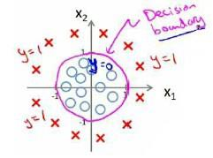
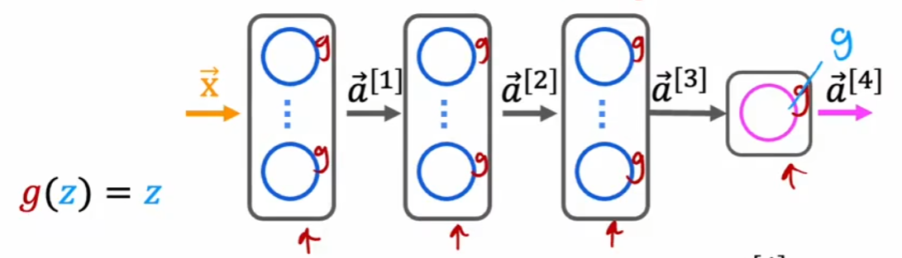

# Machine_learning

## sklearn

### 鸢尾花(KNN)

第一个机器学习实例，体验调包基本流程

****

**获取鸢尾花样本**

```python
iris = datasets.load_iris()
# 鸢尾花属性
X = iris.data
# 鸢尾花结果(数据类别)
y = iris.target

# 打印数据集数组的形状
print(X.shape)
print(y.shape)

'''
(150, 4)
(150,)
'''
```

**分割训练集和测试集**

`test_size=0.3`表示测试集占总数据集的30%

```python
# 分割训练集和验证集
X_train, X_test, y_train, y_test = train_test_split(X, y, test_size=0.3)
```

分割过程中，数据集会被打乱，在机器学习中，不均匀数据的训练效果好于均匀数据

### datasets

## 引言

### 监督学习

数据集中的每个样本都有对应的"正确答案"

**目的**：对于新的不包含标签的样本，模型希望为其打上标签

回归问题和分类问题

### 非监督学习

数据集中没有标签，已知数据集但不知道应该如何处理

**目的**：针对数据集，划分出不同的数据簇，又称为==聚类算法==

## 单变量线性回归

### 模型表示

**回归**：我们根据之前的数据预测出一个准确的输出值

**房屋价格问题**：探究房屋`size`与`prize`之间的关系

(𝑥, 𝑦) 代表训练集中的实例

𝑚来表示训练样本的数目

ℎ 代表学习算法的解决方案或函数也称为假设（**hypothesis**）


**h的表达方式**
$$
h_\theta(x) = \theta_0 + \theta_1 x
$$
只含有一个特征/输入变量，这类问题成为单变量线性回归问题

### 代价函数

**建模误差**：模型预测的值与训练集中实际值的差距,即$h_\theta(x^{(i)}) - y^{(i)}$


**目标**：选择出建模误差的平方和最小的模型参数即$\theta_0$和$\theta_1$

**代价函数**：
$$
J(\theta_0, \theta_1) = \frac{1}{2m} \sum_{i=1}^{m} \left( h_\theta(x^{(i)}) - y^{(i)} \right)^2
$$
应使$J(\theta_0, \theta_1)$值为最小，此时的$\theta_0$和$\theta_1$即为目标结果

我们可以画出三维图(等高线图)进行更直观的观察


图中这张网的最低点对于的$\theta$即为我们要找的参数值

### 梯度下降

==梯度下降==是一种用来求代价函数最小值的算法

**流程**

首先随机选择一个参数组合$(\theta_0,\theta_1...\theta_n)$,求其代价函数，再继续寻找下一个能让代价函数下降最多的参数组合，并会得出一个局部最小值(local minimum)

局部最小值是最终结果吗？

<font color="red">等高线图告诉我们并不是！</font>


**公式**
$$
\text{repeat until convergence \{ } 
\theta_j := \theta_j - \alpha \frac{\partial}{\partial \theta_j} J(\theta_0, \theta_1) \quad \\(\text{for } j = 0 \text{ and } j = 1) 
\text{\}}
$$
**$\alpha$学习率(learn rate)**：表示沿着代价函数下降程度最大的方向能迈出最大的步子有多大

**$\frac{\partial}{\partial \theta_j} J(\theta_0, \theta_1)$(代价函数偏导)**：代价函数对$\theta_j$参数的偏导数

**公式解读**：在梯度下降过程中，每一次将所有参数减去==学习率==乘以==代价函数对于该参数的偏导==，直到达到局部最小值

注意所有的参数都需要同时更新

用二维图更方便理解


$\theta_1$位于$\theta_t$右侧，此时偏导数为正，$\alpha$为正， 则每次循环操作减去一个正值，逼近局部最小

$\theta_2$同理，不过因为负负得正，所以相当于每次循环加上一个正值，从而逼近局部最小

$\alpha$的选值也是非常重要的，如果取值过小，则可能收敛速度缓慢，如果过大又会导致无法收敛，甚至发散

**批量梯度下降**：在梯度下降的每一步中，都用到所有训练样本

## 线性代数

### 矩阵乘法性质

矩阵的乘法不满足交换律：$A \times B \neq B \times A$

矩阵乘法满足结合律：$A \times (B \times C)=(A \times B) \times C$

单位矩阵：如同数的乘法中的1，方阵，从左上角至右下角均为1，用$I$表示
$$
\begin{bmatrix} 1 & 0 & 0 \\ 0 & 1 & 0 \\ 0 & 0 & 1 \end{bmatrix}
$$

$$
AA^{-1}=A^{-1}A=I
$$

$$
AI=IA=A
$$

### 转置

$$
b(i,j)=a(j,i)
$$

$$
\begin{bmatrix}
a & b \\
c & d \\
e & f
\end{bmatrix}^T =
\begin{bmatrix}
a & c & e \\
b & d & f
\end{bmatrix}
$$

$$
(A \pm B)^T = A^T \pm B^T
$$

$$
(A \times B)^T = B^T \times A^T
$$

$$
(A^T)^T = A
$$

$$
(KA)^T = KA^T
$$

## 多变量线性回归

### 多维特征


事实上房价的特征并不只有大小，还有诸如房间数，楼层数，房龄。

$n$代表特征数量

$x^{(i)}$表示第i个训练实例，即特征矩阵中的第i行，是一个**向量**(vector)

例：
$$
x^{(2)} = \begin{bmatrix} 1416 \\ 3 \\ 2 \\ 40 \end{bmatrix}
$$
$x^{(i)}_{j}$代表特征矩阵中的第i个训练实例第j个特征

多变量假设h $h_{\theta}(x)=\theta_{0}+\theta_{1}x_1+\theta_{2}x_2+...\theta_nx_n$

为保持参数和变量数量一致，引入$x_0=1$

 $h_{\theta}(x)=\theta_{0}x_0+\theta_{1}x_1+\theta_{2}x_2+...\theta_nx_n$

则有：θ为一个(n+1)*1的列向量，
$$
\theta=\begin{bmatrix} \theta_0 \\ \theta_1 \\ ... \\ \theta_n \end{bmatrix}
$$
​	  单个实例也 x为一个(n+1)*1的列向量，
$$
x=\begin{bmatrix} x_0 \\ x_1 \\ ... \\ x_n \end{bmatrix}
$$
  	显然，
$$
h_{\theta}(x)=\theta^{T}X
$$

### 多变量梯度下降

多变量代价函数
$$
J(\theta_0, \theta_1, \dots, \theta_n) = \frac{1}{2m} \sum_{i=1}^m \left( h_\theta \left( x^{(i)} \right) - y^{(i)} \right)^2
$$
梯度下降算法：
$$
\text{Repeat} \left\{ \theta_j := \theta_j - \alpha \frac{\partial}{\partial \theta_j} J(\theta_0, \theta_1, \dots, \theta_n) \right\}
$$

$$
\text{Repeat} \left\{ \theta_j := \theta_j - \alpha \frac{\partial}{\partial \theta_j} \left( \frac{1}{2m} \sum_{i=1}^m \left( h_\theta \left( x^{(i)} \right) - y^{(i)} \right)^2 \right) \right\}
$$

### 特征缩放

引入多特征后我们注意到，不同尺度的特征混杂在一起，容易导致代价函数在多维空间中的呈现是不规则的，这会下降我们的收敛效率，会增加迭代次数

**常见的作法是尝试将所有特征的尺度都尽量缩放到-1到1之间**
$$
x_n = \frac{x_n - \mu_n}{s_n},  \quad \mu_n \text{是平均值}, \quad s_n \text{是标准差}
$$

### 学习率

我们通常采用$\alpha$=0.01,0.03,0.1,0.3,1,3,10这类的学习率

### 特征和多项式回归

单纯的线性回归不适合所有问题，生活中存在很多非线性的问题

$h_{\theta}(x)=\theta_0+\theta_1x_1+\theta_2x^2_2$

$h_{\theta}(x)=\theta_0+\theta_1x_1+\theta_2x^2_2+\theta_3x^3_3$

所以先观察数据再选择什么样的模型

### 正规方程

$$
\frac{\partial}{\partial \theta_j} J(\theta_j) = 0
$$

我们用纯数学方法求解出每一个θ值便得出了结果

设训练集特征矩阵为$X$

训练集结果为向量$y$

利用正规方程求解得出
$$
\theta=(X^TX)^{-1}X^Ty
$$
<font color='red'>局限性</font>

- 对于不可逆矩阵无法使用，特征之间不独立

| 梯度下降                            | 正规方程                                                     |
| ----------------------------------- | ------------------------------------------------------------ |
| 需要选择学习率 \( $\alpha$ \)       | 不需要                                                       |
| 需要多次迭代                        | 一次运算得到                                                 |
| 当特征数量 \( n \) 大时也能较好适用 | 需要计算  $(X^TX)^{-1}$ 。如果特征数量 \( n \) 较大则运算代价大，因为矩阵求逆的计算时间复杂度为 \( O($n^3$) \)，通常来说当 \( n \) 小于 10000 时还是可以接受的 |
| 适用于各种类型的模型                | 只适用于线性模型，不适合逻辑回归等其他模型                   |

## 逻辑回归

### 分类问题

**二元分类**

因变量(dependent variable)可能属于的两个类分别称为为负向类(negative class)和正向类(positive class), $y \in \{0, 1\} $

我们可以采用**逻辑回归算法**来处理分类问题，这个算法性质特殊：==它的输出值永远在0到1之间==。

### 假说表示

逻辑回归假设：
$$
h_{\theta}(x)=g(\theta^TX)
\\
g(z)=\frac{1}{1+e^{-z}}
$$
$g(z)$函数图像：


此时，$h_{\theta}(x)$的作用是，对于给定的输入变量，根据选择的参数计算出变量=1的可能性  $h_{\theta}(x)=P(y=1|x;\theta)$

### 判定边界


如图，大致可以确定分界线是一条直线，选择线性回归模型

$\theta_0+\theta_1x_1+\theta_2x_2=0$

$\theta=[-3 \ 1 \ 1]$ 

$x_1+x_2-3=0$



如图，此时我们不能再选取线性回归模型,需要二次方特征

$h_{\theta}(x)=g(\theta_0+\theta_1x_1+\theta_2x_2+\theta_3x^2_1+\theta_4x_2^2)$

$\theta=[-1\ 0\ 0\ 1\ 1]$

$x_1^2+x^2_2-1=0$

### 代价函数

如果用线性回归模型对于代价函数的定义，即所有模型误差的平方和

那么我们得到的代价函数不是平滑的，是一个非凸函数(non-convex)


非凸函数存在多个局部最小值，我们要找全局最小值会遇到困难

重新定义逻辑回归代价函数为
$$
J(\theta) = \frac{1}{m} \sum_{i=1}^{m} Cost\left(h_\theta\left(x^{(i)}\right), y^{(i)}\right)
$$

$$
Cost(h_\theta(x), y) = 
\begin{cases} 
-\log(h_\theta(x)) & \text{if } y = 1 \\
-\log(1 - h_\theta(x)) & \text{if } y = 0 
\end{cases}
$$

将Cost函数调整如下：
$$
Cost(h_\theta(x), y) = -y \cdot \log(h_\theta(x)) - (1 - y) \cdot \log(1 - h_\theta(x))
$$

$$
J(\theta) = -\frac{1}{m} \sum_{i=1}^{m} \left[ y^{(i)} \log \left( h_\theta \left( x^{(i)} \right) \right) - \left( 1 - y^{(i)} \right) \log \left( 1 - h_\theta \left( x^{(i)} \right) \right) \right]
$$

用梯度下降法求解参数即可
$$
\text{repeat} \left\{ \theta_j := \theta_j - \alpha \frac{1}{m} \sum_{i=1}^{m} \left( h_\theta \left( x^{(i)} \right) - y^{(i)} \right) x_j^{(i)} \right\}
$$

### 高级优化

我们在梯度下降的过程中，实际上进行了两个操作

- 计算代价函数$J(\theta)$

- 计算偏导数$\frac{\partial}{\partial \theta_j} J(\theta)$

优化算法：**BFGS(变尺度法) L-BUFGS(限制变尺度法)**

### 多分类问题


创建一个新的“伪”训练集，类型2和类型3设定为negtive,类型1为postive，获得$h^{(1)}_{\theta}(x)$

对于类型2和类型3，同理获得$h^{(2)}_{\theta}(x)$,$h^{(3)}_{\theta}(x)$

于是我们将一个多分类问题分解成多个二分类问题
$$
h_{\theta}(x)=\begin{cases}
h^{(1)}_{\theta}(x)\\
h^{(2)}_{\theta}(x)\\
h^{(3)}_{\theta}(x)
\end{cases}
$$
求解三个二分函数

带入$x$值，选择一个让$h^{(i)}_{\theta}(x)$最大的$i$

## 正则化

### 过拟合

我们有非常多的特征,通过学习得到的假设可能能够非常好地适应训练集(代价函数为0)，但是很有可能对于新的数据来说是毫无意义的。


解决方案

- 丢弃一些不能帮助我们正确预测的特征。可以是手工选择保留哪些特征，或者用一些模型选择的算法来帮忙
- 正则化。保留所有特征，但减少参数的大小

### 修改代价函数

减少产生过拟合的特征的参数值

可以在代价函数中增加惩罚值
$$
J(\theta) = \frac{1}{2m} \left[ \sum_{i=1}^m \left( h_\theta(x^{(i)}) - y^{(i)} \right)^2 + \lambda \sum_{j=1}^n \theta_j^2 \right]
$$
$\lambda$又称为正则化参数(Regularization Parameter)

==规定不对$\theta_0$进行惩罚==


$\lambda$过大，所有参数都最小化，趋近于0，那么拟合模型变成$h_{\theta}(x)=\theta_0$

### 正则化线性回归

### 正则化的逻辑回归模型

## 神经网络

### 非线性假设

线性回归和逻辑回归都有一个明显的缺点：特征过多时，计算负荷会非常大

而使用非线性的多次多项式模型，往往预测效果很好。

假设我们一开始有100个特征，如果用100个特征来构建一个非线性的多项式模型，即便两两组合也会多出5000个特征。

进一步，如果我们采用的都是50*50像素，则会有2500个特征。两两组合则会有$2500^2/2$(300万个)特征

**传统回归模型在此时显然不适用了**

==可以用神经网络解决这个问题==

### 神经网络结构


**Layer0**：输入层

**Layer1，2，3**：隐藏层

**Layer4**：输出层

- 输入层和输出层节点数固定，中间层可以自由指定
- 每个连接线对应不同的权值，这是训练得到的


$\vec{w}^{[1]}_1$：中括号1代表第1层，下标1代表第1个神经元的权重向量

$b$：偏差单位

$a$：激活，每个神经元的输出，单值

$\vec{a}$：一层的输出结果，向量形式

### 前向传播

**前向传播**：神经网络中的计算方向从左到右，沿着每一层依次传播

**特点**

- 层次较前的隐藏层隐藏单元较多，较后的隐藏单元较少
- 传播激活值

### 代码推理


```python
x=np.array([[200.0,17.0]])
layer_1=Dense(units=3,activation='sigmod')
a1=layer_1(x)
layer_2=Dense(units=1,activation='sigmod')
a2=layer_2(a1)
```

由于一些历史原因，Tensorflow中的数据结构与numpy中的数据结构并不相同

我们在python程序中初始化的array对象传入框架后变成tensor(张量)

我们可以借助函数完成tensor向array的转化


==前向传播的一般实现==

```python
//传入参数有上一层的激活a,权重w,偏差单位b,g函数
//设a为长度为2的列向量
a_in=np.array([-2,4])
//权重W为2*3的矩阵
W=np.array([
    [1,-3,5],
    [2,4,-6]
])
//偏差b
b=np.array([-1,1,2])

//构建隐藏层
def dense(a_in,W,b,g):
    units=W.shape[1]
    a_out=np.zero(units)
    for i in range(units):
        w=W[:,i]
        z=np.dot(w,a_in)+b[i]
        a_out[i]=g(z)
    return a_out

//序列化
def sequential(x):
    a1=dense(x,W1,b1)
    a2=dense(a1,W2,b2)
    a3=dense(a2,W3,b3)
    a4=dense(a3,W4,b4)
    f_x=a4
    return f_X
```

## Tensorflow实现

### 激活函数替代方案


Sigmod激活函数的局限在与，返回值介于0~1之间

但是商家对于商品的意识并不一定局限于0~1

**ReLU函数**


$$
g(z)=max(0,z)
$$
**Linear activation function**函数


$$
g(z)=z
$$

### 激活函数选择

对于==输出层==的激活函数选择

| 激活函数                   | 适用情形          |
| -------------------------- | ----------------- |
| Sigmoid                    | y=0/1二分问题     |
| Linear activation function | y=+/- 回归问题    |
| ReLU                       | y=0 or + 回归问题 |

对于==隐藏层==激活函数的选择

ReLU是常见的激活函数选择

```python
from tf.keras.layers import Dense
model= Sequential([
    Dense(units=25,activation='relu'),
    Dense(units=15,activation='relu'),
    Dense(units=1,activation='sigmoid')
])
```

**所以，为什么我们要在神经网络中加入激活函数？**



假设我们在每一层都是用线性激活函数，那么最终的回归结果仍然是线性模型，所有隐藏层都不起作用

### Softmax多分类问题

处理多分类问题时，我们不再使用逻辑回归模型，而使用softmax模型
$$
z_j = \vec{w}_j \cdot \vec{x} + b_j, \quad j = 1, \ldots, N
\\
a_j = \frac{e^{z_j}}{\sum_{k=1}^{N} e^{z_k}} = P(\mathbf{y} = j \mid \mathbf{x})
$$
softmax的代价函数
$$
\text{loss}(a_1, \dots, a_N, y) = 
\begin{cases}
  -\log a_1 & \text{if } y = 1 \\
  -\log a_2 & \text{if } y = 2 \\
  \vdots \\
  -\log a_N & \text{if } y = N
\end{cases}
$$

$$
\vec{a}^{[3]}=(a^{[3]}_1,a^{[3]}_2...a^{[3]}_{10})=g(z_1^{[3]},...z_{10}^{[3]})
$$

### 多标签问题


is there a people? is there a car? is there a bus?

$y_1=[1,1,0]$

$y_2=[1,0,0]$

$y_3=[0,1,1]$

这里的y不再是一个单值而是一个向量


output layer使用sigmoid模型

## 模型诊断

### 模型选择和交叉验证集

假设我们要在 10 个不同次数的二项式模型之间进行选择：


适应训练数据集并不代表着能推广至一般情况。我们需要使用交叉验证集来帮助选择模型


60%的数据作为训练集，20%的数据作为交叉验证集，20%的数据作为测试集

**模型选择方法如下：**

1. 使用训练集训练出 10 个模型
2. 用 10 个模型分别对交叉验证集计算得出代价函数的值
3. 选取代价函数值最小的模型
4. 用步骤 3 中选出的模型对测试集计算得出代价函数的值

Training error:
$$
J_{train}(\vec{w},b) = \frac{1}{2m_{train}} \sum_{i=1}^{m_{train}} \left( f_{\vec{w},b}(x^{(i)}) - y^{(i)} \right)^2
$$

Cross Validation error:
$$
J_{cv}(\vec{w},b) = \frac{1}{2m_{cv}} \sum_{i=1}^{m} \left( f_{\vec{w},b}(x_{cv}^{(i)}) - y_{cv}^{(i)} \right)^2
$$

Test error:
$$
J_{test}(\vec{w},b) = \frac{1}{2m_{test}} \sum_{i=1}^{m_{test}} \left( f_{\vec{w},b}(x_{test}^{(i)}) - y^{(i)} \right)^2
$$

### 偏差与方差

**过拟合**：高方差

**欠拟合**：高偏差


==多项式度数为自变量==

- 偏差$J_{train}(\vec{w},b)$不断下降贴近于0
- 方差$J_{cv}(\vec{w},b)$先下降后升高，度数过低，则函数的可解释性太差，拟合能力和泛化能力都很差。度数过高，对于训练集的拟合能力很强，但泛化能力可能很差

### 正则化偏差与方差

$$
J(\vec{w},b) = \frac{1}{2m} \left[ \sum_{i=1}^m \left( f_{\vec{w},b}(x^{(i)}) - y^{(i)} \right)^2 + \lambda \sum_{j=1}^n w_j^2 \right]
$$


$\lambda$过大，所有参数都极小，$f(\vec{w},b)=b$


$\lambda$过小，相当于没有做正则化，则会导致偏差很小，方差很大


现在以$\lambda$为自变量

- $J_{train}$逐渐升高，$\lambda$极小时，拟合效果很好，但是过拟合，$J_{cv}$很大
- $J_{cv}$先下降再升高，当$\lambda$很大时，$f(\vec{w},b)$是一条水平线，$J_{cv}$很大

### 性能评估基准

所谓高偏差，高方差都是相对而言

**我们可以以人脑的表现水平作为基准**

| 标准                   | 错误率 |
| ---------------------- | ------ |
| Baseline performance   | 10.6%  |
| Training error         | 10.8%  |
| Cross validation error | 14.8%  |

### 学习曲线


以训练集大小$m_{train}$为自变量,学习曲线如图所示

训练集不是越大越好

训练集较小时，函数很好拟合，$J_{train}$自然很小，但此时的拟合结果与理想效果相差很远，$J_{cv}$极大

训练集较大时，$J_{train}$升高，$J_{cv}$下降

**考虑以下几种应对方法，分别对应什么情形**

- 增加训练集数量    ==高方差问题==
- 减少特征集   ==高方差问题==
- 增加特征集   ==高偏差问题==
- 增加多项式特征  ==高偏差问题==
- 减小$\lambda$   ==高偏差问题==
- 增加$\lambda$  ==高方差问题==

### 精准率和召回率


**精准率**：
$$
Precision=\frac{True \ positives}{True \ pos+False\ pos}
$$
**召回率**：
$$
Recall=\frac{True \ pos}{True \ pos+False\ neg}
$$

我们需要在精准率和召回率之间进行权衡

计算$F$
$$
F=2\frac{PR}{P+R}
$$


## 决策树

### 纯度


$p_1$：pos占全部示例集的比例

$H(p_1)$：示例集的熵,用于衡量一组数据是否不纯
$$
p_0=1-p_1
\\
H(p_1)=-p_1log_2(p_1)-p_0log_2{p_0}
$$
熵实际上代表了这个示例集的纯度，如果示例集纯阳或者纯阴，那么熵为0，如果阴阳五五开，那么熵最高。

### 信息增益


$$
Information\ gain=H(p_1^{root})-(w^{left}H(p_1^{left})+w^{right}H(p_1^{right}))
$$

### one-hot 编码


对于==离散特征==，当一个特征有多个值时,我们可以将这个特征拆分成多个特征。

### 连续值处理

对于连续值我们不能再使用0，1进行离散化处理

选择不同阈值对数据集进行分割

尝试多个阈值并分别计算对于的Information gain

选取信息增益最高的阈值

### 回归树

使用决策模型解决回归问题时，我们需要更改信息增益的计算方式
$$
Information\ gain=v^{root}-(w^{left}v^{left}+w^{right}v^{right})
$$

### 随机森林

普通决策树模型的缺点是==对数据集非常敏感，方差很大==

我们可以用集成树模型处理分类问题

将一组测试数据交给多颗决策树进行测试，投票得出最终分类结果

**流程**：

1、有放回抽样选择出多个与原数据集大小相同的数据集（可能存在重复行）

2、为每个新数据集随机挑选特征子集，子集大小可以是特征总数的平方根

3、训练得出多棵树，形成森林

### XGBoost

## 聚类

### 基础概念


**Traning set**: $\{ x^{(1)},x^{(2)},...x^{(m)}\} $

非监督学习中，不存在y的标签值

$c^{(i)}$：$x^{(i)}$现在被分配到的簇集(1,2,....,K)

$\mu_k$：k簇质心

$\mu_{c^{(i)}}$：$x^{(i)}$被分配到的簇质心

### K-means

第一步随机选择两个点

K-means在反复做两件事情

- 将点分配给集群质心
- 移动集群质心

**逻辑**：

>首先随意确定两个簇质心，进行操作1，通过计算平均值刷新簇质心，进行操作2，因为簇质心的位置产生了移动，所以原来的分配失效，再次进行操作1

**成本函数**
$$
J(c^{(1)},...,c^{(m)},\mu_1,...,\mu_k)=\frac{1}{m}\sum_{i=1}^{m}||x_{(i)}-\mu_{c^{(i)}}||^2
$$
K-means算法的代价函数同样存在局部最优解

未避免局部最优解问题，我们需要多选几个初始化的簇质心集合，选出拟合过后代价函数最小的那个

### 聚类数量选择

